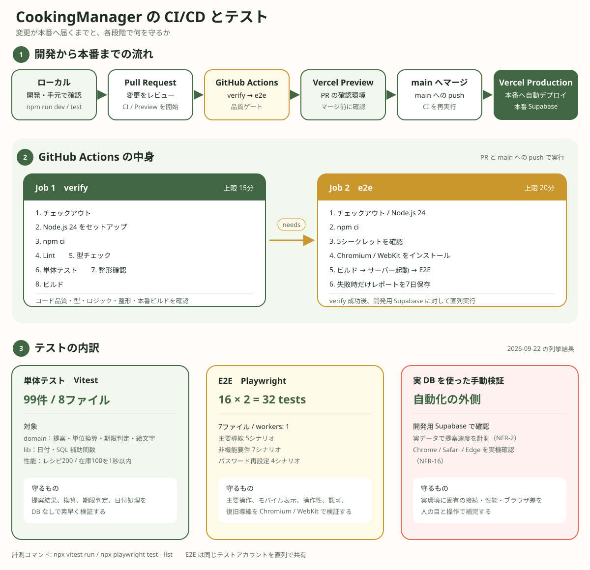

# CI/CD とテスト

図中の件数は `npx vitest run` と `npx playwright test --list` で確認した値である。Playwright の 16 シナリオを Chromium と WebKit の2プロジェクトで実行するため、列挙上は 32 tests となる。

## GitHub Actions のシークレット

値はリポジトリに置かず、GitHub Actions のシークレットとして設定する。

| シークレット | 用途 |
|---|---|
| `E2E_EMAIL` | テスト用アカウントのメールアドレス |
| `E2E_PASSWORD` | テスト用アカウントのパスワード |
| `E2E_SUPABASE_URL` | 開発用 Supabase プロジェクトの URL |
| `E2E_SUPABASE_ANON_KEY` | 開発用 Supabase プロジェクトの匿名キー |
| `E2E_DATABASE_URL` | データ準備と後片付けに使う開発用 DB の接続文字列 |

## E2E の実行環境

E2E は本番ではなく、開発用 Supabase プロジェクトに接続する。テスト用の1アカウントを全シナリオで共有し、実行前後にそのアカウントのデータを空にする。他のユーザーの行には触れない。同じデータを複数のテストが同時に変更しないよう、`workers: 1` で直列実行する。

Playwright の `webServer` は、テストのたびに本番相当のビルドからサーバー起動までを通しで行う。`NEXT_PUBLIC_*` はビルド時に値が埋め込まれ、実行時に環境変数を渡すだけでは接続先を変更できないためである。開発用 Supabase の値を明示してビルドし直すことで、ローカルの本番向け設定を誤って使うことも防ぐ。
