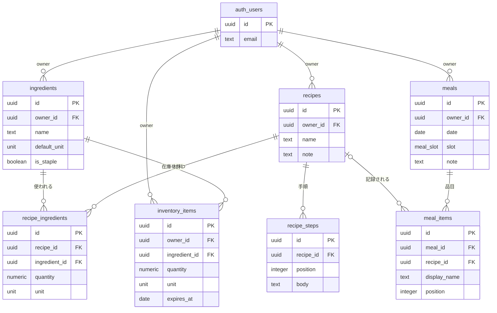

# DB設計書

CookingManager のデータベーススキーマ、制約、インデックス、アクセス制御、マイグレーション方針を定義する。

関連: [要件定義書](../spec/cooking-manager-requirements.md) ／ [システム設計書](system.md) ／ [画面設計書](screen-design.md)

DBMS は Supabase（PostgreSQL）、ORM は Drizzle。本書の DDL は最終的に Drizzle のスキーマ定義として実装し、マイグレーションを生成する。

---

## 1. 設計方針

| # | 方針 | 根拠 |
|---|---|---|
| 1 | 所有者を `owner_id` 単一列で表現する | 将来の世帯共有に備える（NFR-14） |
| 2 | 全テーブルに RLS を有効化し、`owner_id = auth.uid()` で遮断する | アプリ層の実装漏れが漏洩に直結しない（NFR-4） |
| 3 | 主キーは UUID（`gen_random_uuid()`） | 連番だと他レコードの存在が推測できる。Supabase Auth の `auth.users.id` と型を揃える |
| 4 | 時刻は `timestamptz` で UTC 保存、表示時に Asia/Tokyo へ変換 | NFR-11 |
| 5 | 賞味期限は `date`（時刻を持たない） | 「あと2日」の判定に時刻の精度は不要。日付境界の扱いが単純になる |
| 6 | 数量は `numeric(10,2)` | 浮動小数点の誤差を避ける。0.5個・1.25kg のような入力を許容する |
| 7 | 削除は物理削除を基本とし、履歴性のあるデータのみ値を複写して残す | [4章](#4-削除時の挙動)を参照 |
| 8 | 正規化は第3正規形まで。非正規化は行わない | この規模では結合コストより整合性の維持を優先する（NFR-2 は満たせる） |

---

## 2. ER図



`auth_users` は Supabase Auth が管理する `auth.users`。アプリ側では作成しない。

---

## 3. 列挙型

```sql
-- 単位。質量・容量は換算し、可算単位は換算しない（F6-6 / システム設計 5.1）
CREATE TYPE unit AS ENUM (
  'g', 'kg', 'ml', 'L',
  '個', '袋', 'パック', '本', '束', '枚', '缶', '箱'
);

-- 食事区分（F4-1）
CREATE TYPE meal_slot AS ENUM ('breakfast', 'lunch', 'dinner', 'snack');
```

**単位はマスタテーブルではなく列挙型で持つ。** 変換ルール（`kg → g` は1000倍など）はアプリケーション層の定数として持ち、DB には置かない。理由は3つ。

1. 単位の追加はアプリの変換ロジックの変更を伴うため、DB だけ更新しても動かない。両者を同時に変更するなら列挙型のほうが齟齬が起きない
2. 提案アルゴリズムは TypeScript 側で実行する（技術要件「提案アルゴリズムの実行場所」）。変換表を DB から読む必要がない
3. ユーザーが単位を自由に増やす要件はない（F2-1 は「標準単位」を持つとだけ定めている）

列挙型への値追加は `ALTER TYPE unit ADD VALUE` で可能。削除はできないため、不要になった単位は使用を止めるだけとする。

---

## 4. 削除時の挙動

| 削除対象 | 参照元 | 挙動 | 理由 |
|---|---|---|---|
| 食材 | `recipe_ingredients`、`inventory_items` | **`ON DELETE RESTRICT`**（禁止） | 材料が欠けたレシピや、対象のない在庫を生まない。C-3 で「レシピ3件・在庫1件から使われています」と示して止める |
| レシピ | `recipe_ingredients`、`recipe_steps` | `ON DELETE CASCADE` | 材料と手順はレシピの一部であり、単独では意味を持たない |
| レシピ | `meal_items` | **`ON DELETE SET NULL`** ＋ 料理名を `display_name` に複写 | 食事記録は履歴。レシピを消しても「何を食べたか」は残す |
| 食事記録 | `meal_items` | `ON DELETE CASCADE` | 品目は記録の一部 |
| 在庫 | — | 物理削除 | 履歴性を持たない。数量0は行を残し、既定表示から外す（F5-3） |

`meal_items.display_name` は**登録時点の料理名を常に複写する**。レシピ参照の品目でも自由入力の品目でも、この列に表示名が入る。レシピ名が後から変更されても記録側の表示は変わらないが、「そのとき何を食べたか」の記録としてはそのほうが正確。

---

## 5. テーブル定義

### 5.1 ingredients（食材マスタ / F2-1）

| 列 | 型 | NULL | 既定 | 説明 |
|---|---|---|---|---|
| `id` | `uuid` | × | `gen_random_uuid()` | 主キー |
| `owner_id` | `uuid` | × | — | 所有者。`auth.users(id)` を参照 |
| `name` | `text` | × | — | 食材名 |
| `default_unit` | `unit` | × | — | 標準単位 |
| `is_staple` | `boolean` | × | `false` | 常備食材。true なら不足判定から除外（F6-4） |
| `created_at` | `timestamptz` | × | `now()` | — |
| `updated_at` | `timestamptz` | × | `now()` | — |

```sql
CREATE TABLE ingredients (
  id            uuid PRIMARY KEY DEFAULT gen_random_uuid(),
  owner_id      uuid NOT NULL REFERENCES auth.users(id) ON DELETE CASCADE,
  name          text NOT NULL CHECK (length(btrim(name)) BETWEEN 1 AND 50),
  default_unit  unit NOT NULL,
  is_staple     boolean NOT NULL DEFAULT false,
  created_at    timestamptz NOT NULL DEFAULT now(),
  updated_at    timestamptz NOT NULL DEFAULT now(),
  -- 同一オーナー内で食材名を一意にする（F2-3 重複作成の防止）
  CONSTRAINT ingredients_owner_name_key UNIQUE (owner_id, name)
);
```

一意制約により、F2-3 の重複防止を DB 層でも担保する。アプリ側は候補提示で未然に防ぎ、競合時は `CONFLICT` を返す。

### 5.2 recipes（レシピ / F3-1）

| 列 | 型 | NULL | 既定 | 説明 |
|---|---|---|---|---|
| `id` | `uuid` | × | `gen_random_uuid()` | 主キー |
| `owner_id` | `uuid` | × | — | 所有者 |
| `name` | `text` | × | — | 料理名 |
| `note` | `text` | ○ | `null` | メモ |
| `created_at` | `timestamptz` | × | `now()` | — |
| `updated_at` | `timestamptz` | × | `now()` | — |

```sql
CREATE TABLE recipes (
  id          uuid PRIMARY KEY DEFAULT gen_random_uuid(),
  owner_id    uuid NOT NULL REFERENCES auth.users(id) ON DELETE CASCADE,
  name        text NOT NULL CHECK (length(btrim(name)) BETWEEN 1 AND 100),
  note        text CHECK (note IS NULL OR length(note) <= 1000),
  created_at  timestamptz NOT NULL DEFAULT now(),
  updated_at  timestamptz NOT NULL DEFAULT now()
);
```

料理名は一意にしない。「カレー」を複数登録したい場合を妨げないため。

### 5.3 recipe_ingredients（レシピ材料 / F3-2）

| 列 | 型 | NULL | 既定 | 説明 |
|---|---|---|---|---|
| `id` | `uuid` | × | `gen_random_uuid()` | 主キー |
| `recipe_id` | `uuid` | × | — | レシピ |
| `ingredient_id` | `uuid` | × | — | 食材 |
| `quantity` | `numeric(10,2)` | × | — | 必要量。正の数 |
| `unit` | `unit` | × | — | 単位。食材の標準単位と異なってよい |

```sql
CREATE TABLE recipe_ingredients (
  id             uuid PRIMARY KEY DEFAULT gen_random_uuid(),
  recipe_id      uuid NOT NULL REFERENCES recipes(id) ON DELETE CASCADE,
  ingredient_id  uuid NOT NULL REFERENCES ingredients(id) ON DELETE RESTRICT,
  quantity       numeric(10,2) NOT NULL CHECK (quantity > 0),
  unit           unit NOT NULL,
  -- 同一レシピ内で同じ食材を2行に分けない
  CONSTRAINT recipe_ingredients_recipe_ingredient_key UNIQUE (recipe_id, ingredient_id)
);
```

**「材料は最低1件必須」（F3-2）は DB 制約では表現しない。** 行が0件であることを CHECK では禁じられないため、Server Action の入力検証（Zod）で担保する。レシピと材料は同一トランザクションで挿入する。

### 5.4 recipe_steps（レシピ手順 / F3-1）

| 列 | 型 | NULL | 既定 | 説明 |
|---|---|---|---|---|
| `id` | `uuid` | × | `gen_random_uuid()` | 主キー |
| `recipe_id` | `uuid` | × | — | レシピ |
| `position` | `integer` | × | — | 表示順。1始まり |
| `body` | `text` | × | — | 手順の本文 |

```sql
CREATE TABLE recipe_steps (
  id         uuid PRIMARY KEY DEFAULT gen_random_uuid(),
  recipe_id  uuid NOT NULL REFERENCES recipes(id) ON DELETE CASCADE,
  position   integer NOT NULL CHECK (position > 0),
  body       text NOT NULL CHECK (length(btrim(body)) BETWEEN 1 AND 500),
  CONSTRAINT recipe_steps_recipe_position_key UNIQUE (recipe_id, position) DEFERRABLE INITIALLY DEFERRED
);
```

手順を配列列（`text[]`）ではなく別表にするのは、R-4 の並べ替え（ドラッグハンドル）で行単位に更新したいため。並べ替え時に一時的に `position` が重複するため、一意制約を `DEFERRABLE INITIALLY DEFERRED` にしてトランザクション終了時に検査する。

### 5.5 inventory_items（在庫 / F5-1）

| 列 | 型 | NULL | 既定 | 説明 |
|---|---|---|---|---|
| `id` | `uuid` | × | `gen_random_uuid()` | 主キー |
| `owner_id` | `uuid` | × | — | 所有者 |
| `ingredient_id` | `uuid` | × | — | 食材 |
| `quantity` | `numeric(10,2)` | × | — | 数量。0以上 |
| `unit` | `unit` | × | — | 単位 |
| `expires_at` | `date` | ○ | `null` | 賞味期限。任意（F5-1） |
| `created_at` | `timestamptz` | × | `now()` | — |
| `updated_at` | `timestamptz` | × | `now()` | — |

```sql
CREATE TABLE inventory_items (
  id             uuid PRIMARY KEY DEFAULT gen_random_uuid(),
  owner_id       uuid NOT NULL REFERENCES auth.users(id) ON DELETE CASCADE,
  ingredient_id  uuid NOT NULL REFERENCES ingredients(id) ON DELETE RESTRICT,
  quantity       numeric(10,2) NOT NULL CHECK (quantity >= 0),
  unit           unit NOT NULL,
  expires_at     date,
  created_at     timestamptz NOT NULL DEFAULT now(),
  updated_at     timestamptz NOT NULL DEFAULT now()
);
```

**同じ食材の在庫を複数行持てる。** 買い足した分を別行にすることで、賞味期限を個別に管理できる。提案では合計して判定する（F6-5）。

数量は0を許容する。使い切った在庫は行を残したまま既定表示から外す（F5-3）。`CHECK (quantity >= 0)` により、差分更新で負にならないことを DB 層でも保証する。

### 5.6 meals（食事記録 / F4-1）

| 列 | 型 | NULL | 既定 | 説明 |
|---|---|---|---|---|
| `id` | `uuid` | × | `gen_random_uuid()` | 主キー |
| `owner_id` | `uuid` | × | — | 所有者 |
| `date` | `date` | × | — | 日付（Asia/Tokyo での日付） |
| `slot` | `meal_slot` | × | — | 食事区分 |
| `note` | `text` | ○ | `null` | メモ |
| `created_at` | `timestamptz` | × | `now()` | — |
| `updated_at` | `timestamptz` | × | `now()` | — |

```sql
CREATE TABLE meals (
  id          uuid PRIMARY KEY DEFAULT gen_random_uuid(),
  owner_id    uuid NOT NULL REFERENCES auth.users(id) ON DELETE CASCADE,
  date        date NOT NULL,
  slot        meal_slot NOT NULL,
  note        text CHECK (note IS NULL OR length(note) <= 200),
  created_at  timestamptz NOT NULL DEFAULT now(),
  updated_at  timestamptz NOT NULL DEFAULT now(),
  -- 1日1区分につき1レコード。複数の品目は meal_items で表現する（F4-3）
  CONSTRAINT meals_owner_date_slot_key UNIQUE (owner_id, date, slot)
);
```

`date` は Asia/Tokyo における日付を格納する。UTC で日付を算出すると、日本時間の朝9時以前の記録が前日にずれるため、日付の決定はアプリ層で `Asia/Tokyo` に変換してから行う（NFR-11）。

### 5.7 meal_items（食事記録の品目 / F4-2, F4-3）

| 列 | 型 | NULL | 既定 | 説明 |
|---|---|---|---|---|
| `id` | `uuid` | × | `gen_random_uuid()` | 主キー |
| `meal_id` | `uuid` | × | — | 食事記録 |
| `recipe_id` | `uuid` | ○ | `null` | レシピ参照。自由入力の場合は null |
| `display_name` | `text` | × | — | 表示名。登録時点の料理名を複写する |
| `position` | `integer` | × | — | 表示順。1始まり |

```sql
CREATE TABLE meal_items (
  id            uuid PRIMARY KEY DEFAULT gen_random_uuid(),
  meal_id       uuid NOT NULL REFERENCES meals(id) ON DELETE CASCADE,
  recipe_id     uuid REFERENCES recipes(id) ON DELETE SET NULL,
  display_name  text NOT NULL CHECK (length(btrim(display_name)) BETWEEN 1 AND 100),
  position      integer NOT NULL CHECK (position > 0),
  CONSTRAINT meal_items_meal_position_key UNIQUE (meal_id, position) DEFERRABLE INITIALLY DEFERRED
);
```

`recipe_id` の有無で「登録済みレシピ」と「自由入力」を区別する（F4-2）。M-2 の `レシピ` バッジは `recipe_id IS NOT NULL` で判定する。レシピ削除後は `recipe_id` が null になり、バッジが外れて `display_name` だけが残る。

---

## 6. インデックス

提案の算出（NFR-2）と各一覧画面のクエリに必要なものを置く。

```sql
-- 提案: 有効な在庫の抽出（F5-5 期限切れ除外 → 食材ごとの集計）
-- P-1: 期限の近い順の表示（F5-2）と、3日以内の警告（F5-4）にも同じ索引が効く
CREATE INDEX idx_inventory_owner_expires ON inventory_items (owner_id, expires_at);
CREATE INDEX idx_inventory_owner_ingredient ON inventory_items (owner_id, ingredient_id);

-- 提案: レシピの材料をまとめて取得（N+1を避け1クエリで引く）
CREATE INDEX idx_recipe_ingredients_recipe ON recipe_ingredients (recipe_id);
CREATE INDEX idx_recipe_ingredients_ingredient ON recipe_ingredients (ingredient_id);

-- R-1: レシピ一覧・料理名検索（F3-3）
CREATE INDEX idx_recipes_owner_name ON recipes (owner_id, name);

-- R-2/R-4: 手順の取得
CREATE INDEX idx_recipe_steps_recipe_position ON recipe_steps (recipe_id, position);

-- C-2/入力補助: 食材の部分一致検索（F2-2）
CREATE INDEX idx_ingredients_owner_name ON ingredients (owner_id, name);

-- M-1: 月単位の記録取得（F4-4）
CREATE INDEX idx_meals_owner_date ON meals (owner_id, date);

-- M-2: 品目の取得
CREATE INDEX idx_meal_items_meal_position ON meal_items (meal_id, position);
```

### 部分一致検索について

F2-2 の食材検索は前方一致（`name LIKE 'ほうれん%'`）であれば `idx_ingredients_owner_name` が効く。中間一致（`%ほうれん%`）ではインデックスが使われないが、**食材は個人あたり数百件の規模のため全件走査でも支障はない。** 件数が増えて問題になった場合は `pg_trgm` 拡張と GIN インデックスの追加を検討する。

### NFR-2 を満たす根拠

提案の算出で発行するクエリは2本のみ。

| # | クエリ | 使うインデックス | 想定行数 |
|---|---|---|---|
| 1 | 有効な在庫＋食材の取得 | `idx_inventory_owner_expires` | 100 |
| 2 | 全レシピ＋材料の取得 | `idx_recipe_ingredients_recipe` | 200 + 約1200 |

取得後の突き合わせはアプリ層のメモリ上で行う（O(R×I) ≒ 1200回）。DB 往復2回と1200回のマップ参照であり、1秒（NFR-2）に対して十分な余裕がある。

---

## 7. アクセス制御（NFR-4, F1-2）

全テーブルで RLS を有効化する。

```sql
ALTER TABLE ingredients       ENABLE ROW LEVEL SECURITY;
ALTER TABLE recipes           ENABLE ROW LEVEL SECURITY;
ALTER TABLE recipe_ingredients ENABLE ROW LEVEL SECURITY;
ALTER TABLE recipe_steps      ENABLE ROW LEVEL SECURITY;
ALTER TABLE inventory_items   ENABLE ROW LEVEL SECURITY;
ALTER TABLE meals             ENABLE ROW LEVEL SECURITY;
ALTER TABLE meal_items        ENABLE ROW LEVEL SECURITY;
```

### 7.1 owner_id を持つテーブル

```sql
-- ingredients / recipes / inventory_items / meals に同じ形で適用する
CREATE POLICY ingredients_owner_all ON ingredients
  FOR ALL
  USING (owner_id = auth.uid())
  WITH CHECK (owner_id = auth.uid());
```

`USING` が参照・更新・削除の可視範囲を、`WITH CHECK` が挿入・更新後の値を検査する。両方を置くことで、他人の `owner_id` を指定した挿入も防ぐ。

### 7.2 owner_id を持たない子テーブル

`recipe_ingredients`、`recipe_steps`、`meal_items` は所有者列を持たず、親を辿って判定する。

```sql
CREATE POLICY recipe_ingredients_owner_all ON recipe_ingredients
  FOR ALL
  USING (EXISTS (
    SELECT 1 FROM recipes r
    WHERE r.id = recipe_ingredients.recipe_id AND r.owner_id = auth.uid()
  ))
  WITH CHECK (EXISTS (
    SELECT 1 FROM recipes r
    WHERE r.id = recipe_ingredients.recipe_id AND r.owner_id = auth.uid()
  ));
```

`recipe_steps` は同じ形、`meal_items` は `meals` を辿る形で定義する。

**子テーブルに `owner_id` を複写しない理由。** 親子で所有者が食い違う状態を作れてしまうため。EXISTS による親の参照は主キー経由で、この規模では無視できるコスト。

### 7.3 アプリ層との二重化

RLS だけに頼らず、Server Action 側でもセッションの `ownerId` をクエリ条件に含める（[システム設計 9.2](system.md#92-認可f1-2-nfr-4)）。RLS はアプリ層の漏れに対する最後の防御線として機能する。

---

## 8. マイグレーション方針（NFR-12）

| # | 方針 | 内容 |
|---|---|---|
| 1 | Drizzle Kit で生成・管理する | スキーマ定義（TypeScript）を正とし、`drizzle-kit generate` で SQL を出力する |
| 2 | 生成された SQL をリポジトリにコミットする | `drizzle/` 配下。差分がレビュー対象になる |
| 3 | 手書きの SQL も同じ仕組みに載せる | RLS ポリシー・列挙型・`DEFERRABLE` 制約は Drizzle が生成しないため、マイグレーションファイルに手で追記する |
| 4 | 本番への適用は CI から行う | main へのマージ時に `drizzle-kit migrate` を実行する（Issue #1-5, #1-6 で構築） |
| 5 | ロールバックは前進復旧とする | down マイグレーションは書かない。誤りは新しいマイグレーションで打ち消す |
| 6 | 破壊的変更は2段階に分ける | 列の削除・改名は「新列の追加とコピー」→「旧列の削除」の2リリースに分け、途中でアプリが壊れないようにする |

方針5は、個人用でデータ量が小さくバックアップからの復元が現実的であること、down を書いても実行機会がほぼなく検証されないまま腐ることによる。

### 初期マイグレーションの順序

1. 列挙型（`unit`、`meal_slot`）
2. `ingredients` → `recipes` → `recipe_ingredients` / `recipe_steps`
3. `inventory_items`
4. `meals` → `meal_items`
5. インデックス
6. RLS の有効化とポリシー

---

## 9. 画面設計との整合

[画面設計書](screen-design.md)の各画面が必要とするデータを、本スキーマで充足できることを確認した。

| 画面 | 必要なデータ | 対応 |
|---|---|---|
| S-1 | 期限の近い在庫、提案（不足・数量不明を含む） | `inventory_items` ＋ `recipes` ＋ `recipe_ingredients`。算出はアプリ層 |
| R-1 | レシピ名、材料タグ、充足数 | `recipes` ＋ `recipe_ingredients`。充足数は提案と同じ関数で算出 |
| R-2 | 材料ごとの在庫状態、手順 | `recipe_ingredients` ＋ `recipe_steps` ＋ 在庫の突き合わせ |
| R-3 / R-4 | 材料の追加・削除、手順の並べ替え | `recipe_ingredients` の一意制約、`recipe_steps.position`（DEFERRABLE） |
| P-1 | 期限順の在庫、数量の直接増減 | `idx_inventory_owner_expires`、`quantity >= 0` の CHECK |
| P-2 / P-3 | 食材検索、数量・単位・期限 | `ingredients` の一意制約（F2-3）、`expires_at` の NULL 許容 |
| M-1 | 月単位の記録有無（区分ごとのドット） | `idx_meals_owner_date` で月を範囲取得し、`slot` で色分け |
| M-2 | 区分ごとの品目、レシピ由来の判別 | `meal_items.recipe_id IS NOT NULL` |
| M-3 | レシピ選択と自由入力、複数品目 | `recipe_id` の NULL 許容、`position` |
| C-2 / C-3 | 食材一覧、常備食材の切り替え | `is_staple`、`idx_ingredients_owner_name` |

**画面設計書の未確定事項2件を本書で解消した。**

| 未確定事項 | 決定 |
|---|---|
| 参照されている食材を削除したときの挙動 | `ON DELETE RESTRICT` で禁止し、C-3 で参照件数を示して止める（[4章](#4-削除時の挙動)） |
| 単位の選択肢と変換ルールの定義場所 | 単位は列挙型12種、変換ルールはアプリ層の定数（[3章](#3-列挙型)） |

残る未確定事項は「パスワード再設定の画面」「S-1 の表示件数」「`.thumb` プレースホルダの中身」の3件で、いずれもスキーマに影響しない。

---

## 10. 完了条件の対応

| 完了条件 | 該当箇所 |
|---|---|
| ER図がある | [2章](#2-er図) |
| 全テーブルの定義が揃っている | [5章](#5-テーブル定義)（7テーブル） |
| 所有者をオーナーIDで表現している | [1章](#1-設計方針) 方針1、[5章](#5-テーブル定義) の `owner_id` |
| 提案クエリに必要なインデックスが設計されている | [6章](#6-インデックス) |
| 画面設計との整合を確認した | [9章](#9-画面設計との整合) |
