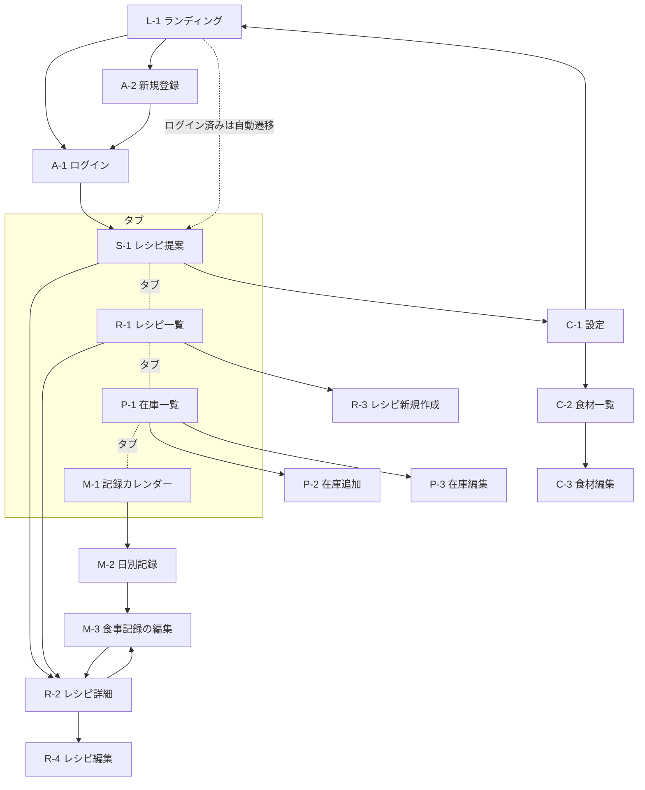

# サイトマップ

CookingManager の全画面、URL構成、画面遷移、ナビゲーション構造を定義する。

関連: [要件定義書](../spec/cooking-manager-requirements.md)

---

## 1. 設計方針

| # | 方針 | 根拠 |
|---|---|---|
| 1 | スマートフォンを主、PCを従とする | キッチンでの利用が主用途（NFR-8） |
| 2 | `/` は未ログイン向けのランディングページとし、アプリ本体と分離する | 機能を説明してから登録に進ませる。アプリ画面と責務が異なる |
| 3 | 主要4機能を下部タブに固定配置する | 在庫追加・食事記録を3タップ以内に収める（NFR-9） |
| 4 | 一覧 → 詳細 → 編集 の3階層までとし、それ以上深くしない | 迷子を防ぎ、戻り導線を単純に保つ |
| 5 | 新規作成・編集はモーダルではなく専用画面とする | 入力途中の離脱でデータを失わない。URLで状態を表現できる |

### タブに何を置くか

要件の機能は F1〜F6 の6つだが、タブは4つに絞る。

| タブ | 対応機能 | 理由 |
|---|---|---|
| 提案 | F6 レシピ提案 | **アプリを開く最大の動機**が「今日何を作るか」であるため、ログイン後の最初の画面とする |
| レシピ | F3 レシピ登録 | — |
| 冷蔵庫 | F5 在庫管理 | 使用頻度が高い |
| 記録 | F4 食事記録 | — |

F1（アカウント）と F2（食材）はタブに置かず、設定画面の配下に置く。食材マスタは在庫・レシピの入力時にその場で作成できるため、単独で開く頻度が低い。

### 画面IDの記号

| 記号 | 区分 |
|---|---|
| L | ランディング |
| A | 認証（Auth） |
| S | レシピ提案（Suggestion） |
| R | レシピ（Recipe） |
| P | 在庫（Pantry） |
| M | 食事記録（Meal） |
| C | 設定（Config） |

---

## 2. 画面一覧

### ランディング

| ID | 画面名 | URL | 目的 | 機能要件 |
|---|---|---|---|---|
| L-1 | ランディング | `/` | アプリの機能を説明し、ログイン・新規登録へ誘導する | — |

**公開画面。** ログイン済みユーザーがアクセスした場合は `/suggestions` へリダイレクトする。

掲載内容:

1. アプリ名とキャッチコピー（「冷蔵庫の残りから、今日の献立を」）
2. 機能説明3点 — レシピ登録 ／ 食事記録 ／ 在庫からのレシピ提案
3. 「はじめる（新規登録）」「ログイン」の2ボタン
4. 使い方の流れ（レシピを登録 → 冷蔵庫を登録 → 提案を受け取る）

### 認証

| ID | 画面名 | URL | 目的 | 機能要件 |
|---|---|---|---|---|
| A-1 | ログイン | `/login` | メールとパスワードでログインする | F1-1 |
| A-2 | 新規登録 | `/signup` | アカウントを作成する | F1-1 |

### レシピ提案

| ID | 画面名 | URL | 目的 | 機能要件 |
|---|---|---|---|---|
| S-1 | レシピ提案 | `/suggestions` | 在庫から作れるレシピを不足の少ない順に見る | F6-1〜F6-7 |

**ログイン後の初期表示画面。** 下部タブの左端に配置する。

### レシピ

| ID | 画面名 | URL | 目的 | 機能要件 |
|---|---|---|---|---|
| R-1 | レシピ一覧 | `/recipes` | 登録済みレシピを一覧・検索する | F3-3 |
| R-2 | レシピ詳細 | `/recipes/[id]` | 材料・手順を見る。材料ごとの在庫有無を確認する | F3-4 |
| R-3 | レシピ新規作成 | `/recipes/new` | レシピを登録する | F3-1, F3-2 |
| R-4 | レシピ編集 | `/recipes/[id]/edit` | レシピを編集・削除する | F3-1 |

### 冷蔵庫（在庫）

| ID | 画面名 | URL | 目的 | 機能要件 |
|---|---|---|---|---|
| P-1 | 在庫一覧 | `/pantry` | 在庫を期限順に見る。数量を直接増減する | F5-2, F5-3, F5-4, F5-5 |
| P-2 | 在庫追加 | `/pantry/new` | 在庫を登録する | F5-1 |
| P-3 | 在庫編集 | `/pantry/[id]/edit` | 在庫を編集・削除する | F5-1 |

### 記録（食事記録）

| ID | 画面名 | URL | 目的 | 機能要件 |
|---|---|---|---|---|
| M-1 | 記録カレンダー | `/meals` | 月単位で記録の有無を見る | F4-4 |
| M-2 | 日別記録 | `/meals/[date]` | その日の食事を区分ごとに見る | F4-4 |
| M-3 | 食事記録の追加・編集 | `/meals/[date]/[slot]/edit` | 品目を追加・編集・削除する | F4-1, F4-2, F4-3 |

`[date]` は `YYYY-MM-DD`、`[slot]` は `breakfast` / `lunch` / `dinner` / `snack`。

### 設定

| ID | 画面名 | URL | 目的 | 機能要件 |
|---|---|---|---|---|
| C-1 | 設定 | `/settings` | 各設定への入口。ログアウトする | F1-3 |
| C-2 | 食材一覧 | `/settings/ingredients` | 食材マスタを一覧・検索する | F2-1 |
| C-3 | 食材編集 | `/settings/ingredients/[id]/edit` | 食材を編集・削除する。常備食材を設定する | F2-1 |

食材の新規作成は専用画面を設けない。レシピ・在庫の入力中に、検索して該当がなければその場で作成する（F2-2, F2-3）。

**合計17画面**（公開3・要ログイン14）。

---

## 3. 機能要件と画面の対応

すべての機能要件がいずれかの画面に割り当てられていることを確認する。

| 機能要件 | 画面 |
|---|---|
| F1-1 登録・ログイン | A-1, A-2（導線は L-1） |
| F1-2 自分のデータのみ | 要ログインの全画面（ミドルウェアで担保） |
| F1-3 ログアウト | C-1 |
| F2-1 食材のCRUD | C-2, C-3 ／ 作成は R-3, R-4, P-2, P-3 の入力中 |
| F2-2 食材の部分一致検索 | R-3, R-4, P-2, P-3 の食材入力欄 |
| F2-3 重複作成の防止 | 同上 |
| F3-1 レシピのCRUD | R-3, R-4 |
| F3-2 材料は最低1件必須 | R-3, R-4 |
| F3-3 レシピ一覧・検索 | R-1 |
| F3-4 材料ごとの在庫有無 | R-2 |
| F4-1 食事記録のCRUD | M-3 |
| F4-2 レシピ参照／自由入力 | M-3 |
| F4-3 複数品目 | M-3 |
| F4-4 日単位・カレンダー閲覧 | M-1, M-2 |
| F5-1 在庫のCRUD | P-2, P-3 |
| F5-2 期限順の表示 | P-1 |
| F5-3 数量の直接増減 | P-1 |
| F5-4 期限3日以内の警告 | P-1（S-1 でも表示） |
| F5-5 期限切れの除外 | P-1, S-1 |
| F6-1 不足食材の算出 | S-1 |
| F6-2 不足の少ない順 | S-1 |
| F6-3 不足食材の表示 | S-1 |
| F6-4 常備食材の除外 | S-1（設定は C-3） |
| F6-5 同一食材の合計 | S-1 |
| F6-6 単位変換・数量不明 | S-1, R-2 |
| F6-7 空状態の案内 | S-1 |

未割り当ての機能要件はない。

---

## 4. 画面遷移図



### 主要な導線

| # | 導線 | 経路 |
|---|---|---|
| 1 | 初回利用 | L-1 →「はじめる」→ A-2 → S-1（空状態からレシピ登録へ誘導） |
| 2 | 今日の献立を決める | S-1 → R-2（詳細で材料を確認）→ 調理 |
| 3 | 作ったものを記録する | R-2 →「食べた記録をつける」→ M-3 |
| 4 | 買い物から帰って在庫を入れる | P-1 → P-2 |
| 5 | レシピを増やす | R-1 → R-3 |

導線3が重要。**レシピ詳細から直接記録に飛べる**ことで、「作る → 記録する」が途切れない。記録タブを経由させると date と slot の選択が挟まり、NFR-9 の3タップを超える。

---

## 5. ナビゲーション構造

### ランディング（L-1）

アプリ内のタブ・サイドバーは表示しない。ヘッダーに「ログイン」、本文中に「はじめる」を置く。

```
┌─────────────────────────┐
│ CookingManager   ログイン │
├─────────────────────────┤
│  冷蔵庫の残りから、       │
│  今日の献立を。           │
│                         │
│  ┌───────────────────┐  │
│  │    はじめる         │  │
│  └───────────────────┘  │
│                         │
│  📖 レシピ登録           │
│  📅 食事記録             │
│  🍽 在庫からレシピ提案    │
└─────────────────────────┘
```

### アプリ内・スマートフォン

画面下部に4タブを固定する。設定はヘッダー右のアイコンから開く。

```
┌─────────────────────────┐
│ CookingManager      ⚙  │  ← ヘッダー（設定へ）
├─────────────────────────┤
│                         │
│      （画面本体）        │
│                         │
├─────────────────────────┤
│  🍽    📖    🧊    📅   │  ← 下部タブ
│  提案  レシピ 冷蔵庫  記録 │
└─────────────────────────┘
```

- タブの高さは 56px 以上、各タブの当たり判定を 44×44px 以上とする（NFR-8）
- 新規作成は各一覧画面の右下に FAB（フローティングボタン）を置く
- 詳細・編集画面ではタブを隠さず、ヘッダー左に「戻る」を置く

### アプリ内・PC

左サイドバーに縦のナビゲーションを置く。一覧と詳細は2カラムで並べてもよい。

```
┌────────┬────────────────────────┐
│ 🍽 提案  │                        │
│ 📖 レシピ │      （画面本体）       │
│ 🧊 冷蔵庫 │                        │
│ 📅 記録  │                        │
│         │                        │
│ ⚙ 設定  │                        │
└────────┴────────────────────────┘
```

### タップ数の検証（NFR-9）

| 操作 | 手順 | タップ数 |
|---|---|---|
| 在庫を追加 | 冷蔵庫タブ → FAB → 食材選択・数量入力 → 保存 | 3タップ＋入力 |
| 食事を記録（レシピから） | レシピ詳細 →「食べた記録をつける」→ 保存 | 2タップ |
| 食事を記録（記録タブから） | 記録タブ → 日付 → 区分の＋ → レシピ選択 → 保存 | 4タップ |

記録タブ経由は4タップになるが、レシピ詳細からの導線（導線3）が2タップで済むため、要件は主導線で満たす。当日の記録については、M-1 カレンダーで**今日を初期選択**しておき、1タップ削る。

---

## 6. 認証とアクセス制御

| 区分 | 画面 | 未ログイン時の挙動 | ログイン済みの挙動 |
|---|---|---|---|
| 公開 | L-1 | そのまま表示 | `/suggestions` へリダイレクト |
| 公開 | A-1, A-2 | そのまま表示 | `/suggestions` へリダイレクト |
| 要ログイン | 上記以外の全14画面 | `/login` へリダイレクトし、元のURLを復帰先として保持する | そのまま表示 |

- 判定は Next.js の middleware で行う（F1-2）
- ログアウト時は L-1 へ遷移する
- DB層では RLS により他ユーザーの行を遮断する（NFR-4）。画面側の制御はあくまで一次防壁とする

---

## 7. URL設計の規則

| 規則 | 例 |
|---|---|
| リソース名は複数形の英小文字 | `/recipes`, `/pantry`, `/meals` |
| 一覧は `/{resource}` | `/recipes` |
| 詳細は `/{resource}/[id]` | `/recipes/abc123` |
| 新規作成は `/{resource}/new` | `/recipes/new` |
| 編集は `/{resource}/[id]/edit` | `/recipes/abc123/edit` |
| 検索・絞り込みはクエリパラメータ | `/recipes?q=カレー` |
| 日付は `YYYY-MM-DD` | `/meals/2026-08-27` |

`/pantry` は在庫（pantry item）の集合を指すが、UI上の表記は「冷蔵庫」とする。

---

## 8. 次工程への申し送り

| 宛先 | 内容 |
|---|---|
| 0-4 システム設計 | 画面ごとに必要なAPI・データ取得を定義する。特に S-1 は提案算出を伴うため、取得範囲とキャッシュ方針を決める |
| 0-5 画面設計 | 本書の17画面すべてについてワイヤーフレームを作成する。S-1・P-1・R-2 は表示ルールが複雑なため優先する |
| 0-6 DB設計 | `[slot]` の4区分、保管場所の3区分をどう持つか（enum か文字列か）を決める |

L-1 は静的な内容のためDBアクセスを伴わない。Next.js の静的生成の対象とし、認証状態の判定のみ middleware で行う。

### 保留した論点

| # | 論点 | 保留理由 |
|---|---|---|
| 1 | S-1 の提案を何件表示するか | 実データを見ないと適切な件数が判断できない。0-5 で暫定値を決め、フェーズ5で調整する |
| 2 | R-1 のレシピ一覧に「いま作れる」バッジを出すか | 一覧の全レシピで提案算出が必要となり、NFR-1 に影響する。0-4 の性能検討とあわせて判断する |
| 3 | 在庫の保管場所（冷蔵/冷凍/常温）で P-1 を分けるか | MVPでは1画面にまとめ、絞り込みで対応する想定。0-5 で確定する |
| 4 | L-1 に実際の画面のスクリーンショットを載せるか | フェーズ7で画面が固まってから判断する |
