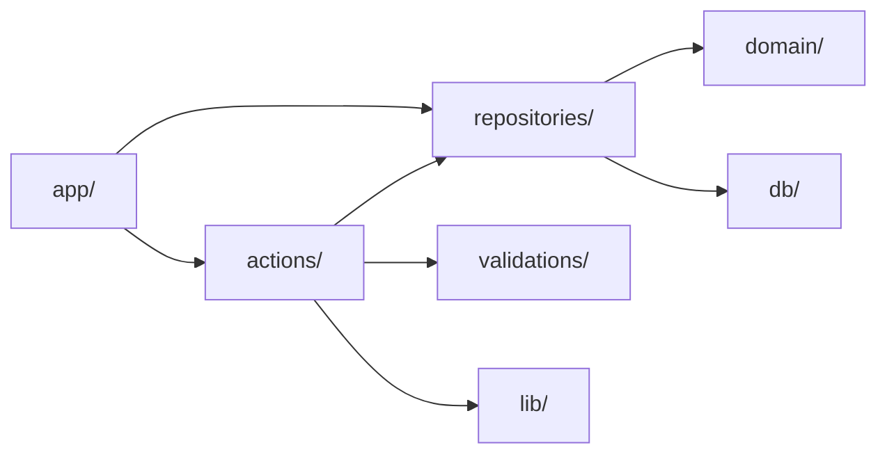

# ファイル設計書

CookingManager のディレクトリ構成、モジュールの責務配置、命名規則、テストの配置を定義する。

関連: [要件定義書](../spec/cooking-manager-requirements.md) ／ [システム設計書](system.md) ／ [DB設計書](database.md) ／ [画面設計書](screen-design.md) ／ [サイトマップ](sitemap.md)

---

## 1. 設計方針

| # | 方針 | 根拠 |
|---|---|---|
| 1 | Next.js App Router の規約に従い、ルーティングは `src/app/` の階層で表現する | フレームワークの規約から外れると学習コストと事故が増える（技術要件） |
| 2 | ドメイン層を `src/domain/` に隔離し、フレームワークと DB を参照させない | 提案アルゴリズムを DB なしで単体テストする（NFR-13） |
| 3 | 機能ごとではなく**層ごと**にディレクトリを切る | 画面17・テーブル7の規模では、機能別の分割はディレクトリが細分化しすぎる |
| 4 | データ取得は `src/repositories/`、変更は `src/actions/` に集約する | 画面から直接 DB を触らせない。RLS 頼みにしない（NFR-4） |
| 5 | テストは対象ファイルの隣に置く | 実装を変えたときにテストを見落としにくい |
| 6 | `src/` 配下に集約し、設定ファイルのみリポジトリ直下に置く | 設定とソースを混在させない |

---

## 2. ディレクトリ構成

```
CookingManager/
├── docs/                              設計ドキュメント（実装対象外）
│   ├── spec/
│   │   └── cooking-manager-requirements.md
│   └── design/
│       ├── sitemap.md
│       ├── system.md
│       ├── database.md
│       ├── screen-design.md
│       ├── structure.md                本書
│       └── mockups/                    デザインカンプとHTML
│
├── drizzle/                           マイグレーション（生成物＋手書きSQL）
│   ├── 0000_init.sql
│   ├── 0001_rls_policies.sql
│   └── meta/
│
├── public/                            静的ファイル
│
├── src/
│   ├── app/                           ルーティング（App Router）
│   │   ├── layout.tsx                 ルートレイアウト。フォント・グローバルCSS
│   │   ├── globals.css                Tailwind のエントリとデザイントークン
│   │   ├── page.tsx                   L-1 ランディング
│   │   │
│   │   ├── (auth)/                    未ログイン向け。タブなしのレイアウト
│   │   │   ├── layout.tsx
│   │   │   ├── login/page.tsx         A-1 ログイン
│   │   │   └── signup/page.tsx        A-2 新規登録
│   │   │
│   │   ├── (app)/                     要ログイン。下部タブありのレイアウト
│   │   │   ├── layout.tsx             TabBar を含む
│   │   │   ├── suggestions/page.tsx   S-1 レシピ提案
│   │   │   ├── recipes/
│   │   │   │   ├── page.tsx           R-1 レシピ一覧
│   │   │   │   ├── new/page.tsx       R-3 レシピ新規作成
│   │   │   │   └── [id]/
│   │   │   │       ├── page.tsx       R-2 レシピ詳細
│   │   │   │       └── edit/page.tsx  R-4 レシピ編集
│   │   │   ├── pantry/
│   │   │   │   ├── page.tsx           P-1 在庫一覧
│   │   │   │   ├── new/page.tsx       P-2 在庫追加
│   │   │   │   └── [id]/edit/page.tsx P-3 在庫編集
│   │   │   ├── meals/
│   │   │   │   ├── page.tsx           M-1 記録カレンダー
│   │   │   │   └── [date]/
│   │   │   │       ├── page.tsx       M-2 日別記録
│   │   │   │       └── [slot]/edit/page.tsx  M-3 記録の追加・編集
│   │   │   └── settings/
│   │   │       ├── page.tsx           C-1 設定
│   │   │       └── ingredients/
│   │   │           ├── page.tsx       C-2 食材一覧
│   │   │           └── [id]/edit/page.tsx    C-3 食材編集
│   │   │
│   │   └── api/                       Route Handlers（逐次呼ぶ検索のみ）
│   │       ├── ingredients/search/route.ts
│   │       └── recipes/search/route.ts
│   │
│   ├── actions/                       Server Actions（変更系）
│   │   ├── auth.ts                    signIn / signUp / signOut
│   │   ├── ingredients.ts             食材のCRUD
│   │   ├── recipes.ts                 レシピのCRUD
│   │   ├── inventory.ts               在庫のCRUD・数量変更
│   │   └── meals.ts                   食事記録のCRUD
│   │
│   ├── repositories/                  データ取得（参照系）
│   │   ├── ingredients.ts
│   │   ├── recipes.ts
│   │   ├── inventory.ts
│   │   ├── meals.ts
│   │   └── suggestions.ts             提案用のデータ取得＋domain の呼び出し
│   │
│   ├── domain/                        ドメイン層（フレームワーク非依存）
│   │   ├── suggestion/
│   │   │   ├── suggest.ts             提案アルゴリズム本体（NFR-13）
│   │   │   ├── suggest.test.ts
│   │   │   ├── types.ts               MatchState / IngredientMatch など
│   │   │   └── index.ts               公開インターフェース
│   │   ├── unit/
│   │   │   ├── convert.ts             単位換算（g⇔kg、ml⇔L）
│   │   │   ├── convert.test.ts
│   │   │   └── units.ts               単位の定義と次元
│   │   └── expiry/
│   │       ├── expiry.ts              期限の判定（今日まで／あとN日／期限切れ）
│   │       └── expiry.test.ts
│   │
│   ├── db/                            DB接続とスキーマ
│   │   ├── schema.ts                  Drizzle のテーブル定義
│   │   ├── client.ts                  接続。サーバー専用
│   │   └── seed.ts                    開発・性能試験用のシード
│   │
│   ├── components/
│   │   ├── ui/                        shadcn/ui の取り込み先（手を入れない）
│   │   └── app/                       アプリ固有のコンポーネント
│   │       ├── tab-bar.tsx            下部タブ4つ
│   │       ├── app-bar.tsx            ヘッダー
│   │       ├── expiry-badge.tsx       期限バッジ
│   │       ├── ingredient-tag.tsx     材料タグ（不足は点線枠）
│   │       ├── quantity-stepper.tsx   数量の増減
│   │       ├── recipe-card.tsx        レシピカード
│   │       ├── delete-sheet.tsx       削除確認（NFR-10）
│   │       └── empty-state.tsx        空状態（F6-7）
│   │
│   ├── lib/                           横断的な補助
│   │   ├── supabase/
│   │   │   ├── server.ts              サーバー用クライアント
│   │   │   └── middleware.ts          セッション更新
│   │   ├── auth.ts                    セッションから ownerId を取得
│   │   ├── date.ts                    Asia/Tokyo での日付計算（NFR-11）
│   │   ├── result.ts                  ActionResult / AppError
│   │   └── errors.ts                  エラーコードとメッセージ
│   │
│   ├── validations/                   Zod スキーマ（入力検証）
│   │   ├── ingredient.ts
│   │   ├── recipe.ts                  材料1件以上の検証を含む（F3-2）
│   │   ├── inventory.ts
│   │   └── meal.ts
│   │
│   ├── types/
│   │   └── index.ts                   エンティティ型（システム設計 4.1）
│   │
│   └── middleware.ts                  認証ガード（F1-2）
│
├── e2e/                               Playwright（フェーズ7で導入）
│   └── suggestions.spec.ts
│
├── .env.example                       キー名のみ。値は置かない（NFR-7）
├── drizzle.config.ts
├── next.config.ts
├── tailwind.config.ts
├── tsconfig.json
├── vitest.config.ts
└── package.json
```

---

## 3. 各ディレクトリの責務

| ディレクトリ | 責務 | 禁止事項 |
|---|---|---|
| `src/app/` | ルーティング、画面の組み立て、データの受け渡し | DB への直接アクセス。ビジネスロジックの記述 |
| `src/actions/` | 入力検証、認可、リポジトリとドメインの呼び出し、`ActionResult` の生成 | 画面の知識を持つこと。SQL の直書き |
| `src/repositories/` | Drizzle によるクエリ。`ownerId` を必ず条件に含める | 入力検証。エラーメッセージの生成 |
| `src/domain/` | 提案アルゴリズム、単位換算、期限判定 | **Next.js・Drizzle・Supabase の import** |
| `src/db/` | スキーマ定義と接続 | クエリの実装（リポジトリの責務） |
| `src/components/ui/` | shadcn/ui が生成したコンポーネント | 手で改変すること（更新時に失われる） |
| `src/components/app/` | アプリ固有の表示部品 | データ取得。Server Action の直接呼び出し |
| `src/lib/` | 横断的な補助関数 | ドメインロジック |
| `src/validations/` | Zod スキーマ | DB アクセス |

### 依存の向き



**`domain/` からは何も参照しない**（型定義を除く）。この一方向を守ることで、提案アルゴリズムを DB なしでテストできる（NFR-13）。

依存方向は ESLint の `import/no-restricted-paths` で機械的に守る。

```javascript
// eslint.config.mjs（抜粋）
{
  zones: [
    { target: './src/domain', from: './src/db' },
    { target: './src/domain', from: './src/actions' },
    { target: './src/domain', from: './src/repositories' },
    { target: './src/domain', from: './src/app' },
    { target: './src/repositories', from: './src/app' },
    { target: './src/components', from: './src/repositories' },
  ],
}
```

---

## 4. 提案アルゴリズムの配置（NFR-13）

`src/domain/suggestion/` に独立モジュールとして置く。

```typescript
// src/domain/suggestion/index.ts
export { suggest } from './suggest';
export type { RecipeSuggestion, IngredientMatch, MatchState } from './types';
```

### 入出力の形

```typescript
// src/domain/suggestion/suggest.ts
import type { Recipe, InventoryItem, Ingredient } from '../../types';

export function suggest(
  recipes: Recipe[],
  inventory: InventoryItem[],
  ingredients: Map<string, Ingredient>,
  today: string,
): RecipeSuggestion[];
```

**引数はすべて素のデータ。** DB のクライアントもリクエストも受け取らない。呼び出し側は次のようになる。

```typescript
// src/repositories/suggestions.ts
import { suggest } from '@/domain/suggestion';

export async function getSuggestions(ownerId: string) {
  const [inventory, recipes, ingredients] = await Promise.all([
    findActiveInventory(ownerId),   // クエリ1本
    findAllRecipesWithIngredients(ownerId), // クエリ1本
    findIngredientMap(ownerId),
  ]);
  return suggest(recipes, inventory, ingredients, todayInTokyo());
}
```

リポジトリが DB との境界を担い、ドメインは純粋な計算だけを行う。テストは `suggest.test.ts` で配列を直接組み立てて検証する（[システム設計 5.4](system.md#54-単体テストで押さえる条件nfr-13) の10条件）。

---

## 5. 命名規則

### 5.1 ファイル・ディレクトリ

| 対象 | 規則 | 例 |
|---|---|---|
| ディレクトリ | ケバブケース。複数形 | `repositories/`、`components/app/` |
| React コンポーネント | ケバブケース | `recipe-card.tsx`、`tab-bar.tsx` |
| それ以外の TypeScript | ケバブケース | `suggest.ts`、`convert.ts` |
| App Router の予約ファイル | Next.js の規約どおり | `page.tsx`、`layout.tsx`、`route.ts` |
| テスト | 対象ファイル名 ＋ `.test.ts` | `suggest.test.ts` |
| ルートグループ | 括弧つきケバブケース | `(auth)/`、`(app)/` |

App Router ではファイル名がそのまま URL になるため、`src/app/` 配下のディレクトリ名は[サイトマップ](sitemap.md)の URL 定義と一致させる。

### 5.2 コード

| 対象 | 規則 | 例 |
|---|---|---|
| コンポーネント | パスカルケース | `RecipeCard`、`TabBar` |
| 関数・変数 | キャメルケース | `getSuggestions`、`ownerId` |
| 型・インターフェース | パスカルケース | `RecipeSuggestion`、`MatchState` |
| 定数 | 大文字スネークケース | `UNIT_TO_BASE`、`MAX_NOTE_LENGTH` |
| Server Action | 動詞から始める | `createRecipe`、`changeInventoryQuantity` |
| リポジトリ関数 | `find` / `list` から始める | `findActiveInventory`、`listRecipes` |
| 真偽値 | `is` / `has` から始める | `isStaple`、`hasOtherDimension` |

Server Action とリポジトリ関数で接頭辞を分けるのは、呼び出し箇所を見ただけで副作用の有無が分かるようにするため。

### 5.3 DB

[DB設計書](database.md)の定義に従う。

| 対象 | 規則 | 例 |
|---|---|---|
| テーブル | スネークケース。複数形 | `recipe_ingredients`、`meal_items` |
| 列 | スネークケース | `owner_id`、`expires_at` |
| 主キー | `id` | — |
| 外部キー | 参照先の単数形 ＋ `_id` | `recipe_id`、`ingredient_id` |
| インデックス | `idx_` ＋ テーブル ＋ 列 | `idx_inventory_owner_expires` |
| 一意制約 | テーブル ＋ 列 ＋ `_key` | `ingredients_owner_name_key` |
| 列挙型 | スネークケース。単数形 | `unit`、`meal_slot` |

TypeScript 側はキャメルケースで扱う。変換は Drizzle のスキーマ定義で行い、手書きのマッピングは書かない。

```typescript
// src/db/schema.ts（抜粋）
export const inventoryItems = pgTable('inventory_items', {
  id: uuid('id').primaryKey().defaultRandom(),
  ownerId: uuid('owner_id').notNull(),
  expiresAt: date('expires_at'),
});
```

---

## 6. テストの配置

| 種別 | 配置 | 対象 | 実行 |
|---|---|---|---|
| 単体 | 対象ファイルの隣（`*.test.ts`） | `src/domain/` 配下すべて（NFR-13） | Vitest |
| 単体 | 同上 | `src/lib/date.ts` などの補助関数 | Vitest |
| 性能 | `src/domain/suggestion/suggest.perf.test.ts` | レシピ200・在庫100で1秒以内（NFR-2） | Vitest |
| E2E | `e2e/*.spec.ts` | 主要導線5本（サイトマップ4章） | Playwright（フェーズ7） |

### 方針

1. **ドメイン層は網羅的にテストする。** 提案アルゴリズムと単位換算は仕様の中心であり、ここが壊れると提案結果が静かに間違う
2. **リポジトリと Server Action は単体テストを書かない。** DB とセッションのモックが実装の写しになり、維持コストに見合わない。E2E で担保する
3. **コンポーネントの単体テストも書かない。** 表示の確認は E2E とモックアップで行う
4. **性能試験を CI に含める。** NFR-2 の1秒を超えたら失敗させる。シードは `src/db/seed.ts` と同じ生成関数を使う

---

## 7. 設定ファイル

| ファイル | 役割 |
|---|---|
| `drizzle.config.ts` | スキーマの場所と出力先（`drizzle/`） |
| `next.config.ts` | Next.js の設定 |
| `tailwind.config.ts` | [画面設計書3章](screen-design.md#3-デザイントークン)のトークンを `theme.extend` に移植する |
| `vitest.config.ts` | テスト対象を `src/**/*.test.ts` に限定 |
| `tsconfig.json` | `@/*` を `src/*` に割り当てる |
| `.env.example` | キー名のみ記載。値は置かない（NFR-7） |

### デザイントークンの移植

`styles.css` の CSS 変数を Tailwind の設定へ写す。モックアップと実装で色がずれないよう、値は[画面設計書](screen-design.md#3-デザイントークン)を唯一の出典とする。

```typescript
// tailwind.config.ts（抜粋）
theme: {
  extend: {
    colors: {
      cream: '#FEFDF9',
      mint:  '#F2F8EE',
      green: { DEFAULT: '#416643', dark: '#325635', soft: '#5A7E57' },
      ink:   { DEFAULT: '#1E2B21', mid: '#5C6B5E', weak: '#9AA69B' },
      danger: { DEFAULT: '#E26354', bg: '#FDF2EF' },
      warn:   { DEFAULT: '#C9972E', bg: '#FEF9E9' },
    },
  },
}
```

---

## 8. 技術選定との整合

[要件定義書4章](../spec/cooking-manager-requirements.md#4-技術要件)で決めた構成と矛盾しないことを確認した。

| 選定 | 本書での扱い |
|---|---|
| Next.js（App Router） | `src/app/` の階層でルーティング。ルートグループでレイアウトを分ける |
| TypeScript | 全ファイル。`@/*` のパスエイリアス |
| Tailwind CSS + shadcn/ui | `components/ui/` に取り込み、改変しない。トークンは `tailwind.config.ts` |
| Server Actions / Route Handlers | `actions/` と `app/api/`。使い分けは[システム設計 7.1](system.md#71-方針) |
| Supabase | `lib/supabase/` にクライアント、`middleware.ts` に認証ガード |
| Drizzle ORM | `db/schema.ts` を正とし、`drizzle/` にマイグレーションを出力 |
| Vitest | 対象ファイルの隣に `*.test.ts` |
| Playwright | `e2e/`。フェーズ7で導入 |
| 提案アルゴリズムをアプリ層で実装 | `src/domain/suggestion/`。DB関数としては実装しない |

---

## 9. 完了条件の対応

| 完了条件 | 該当箇所 |
|---|---|
| ディレクトリ構成がツリーで示されている | [2章](#2-ディレクトリ構成) |
| 提案アルゴリズムが独立モジュールとして配置されている | [4章](#4-提案アルゴリズムの配置nfr-13)。ESLint で依存方向を強制 |
| 命名規則が決まっている | [5章](#5-命名規則)（ファイル・コード・DB） |
| 技術選定（#0-2）で決めたフレームワークの規約と矛盾しない | [8章](#8-技術選定との整合) |
