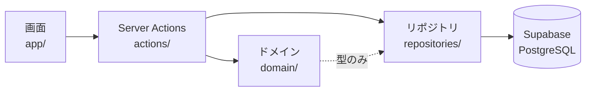
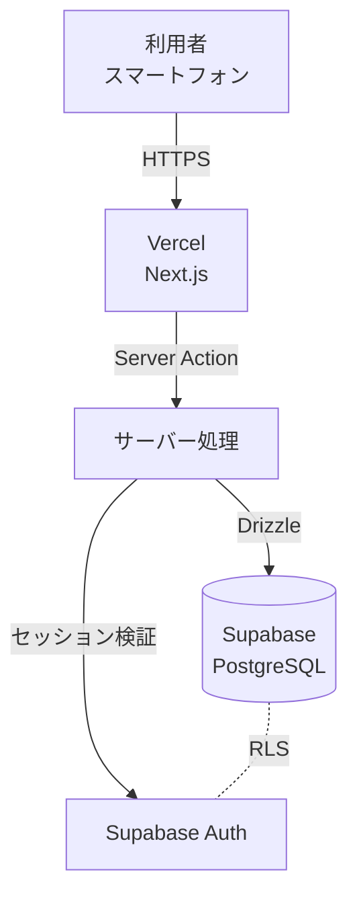
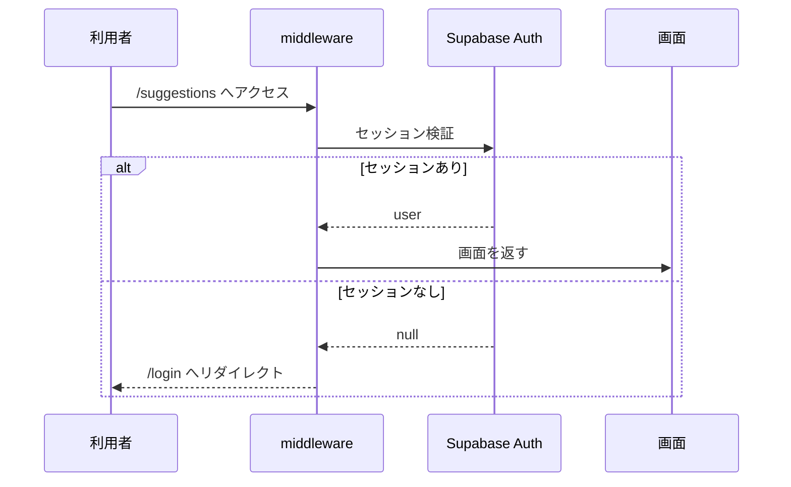
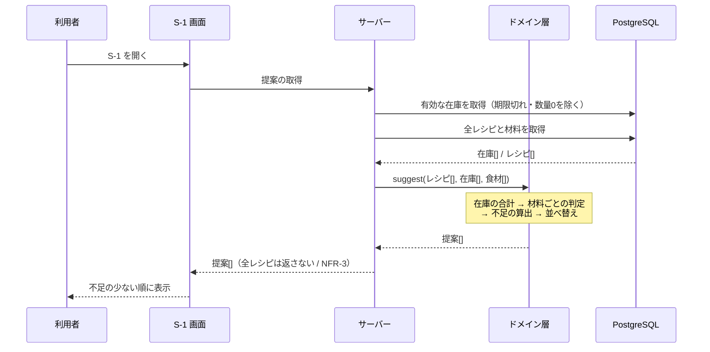
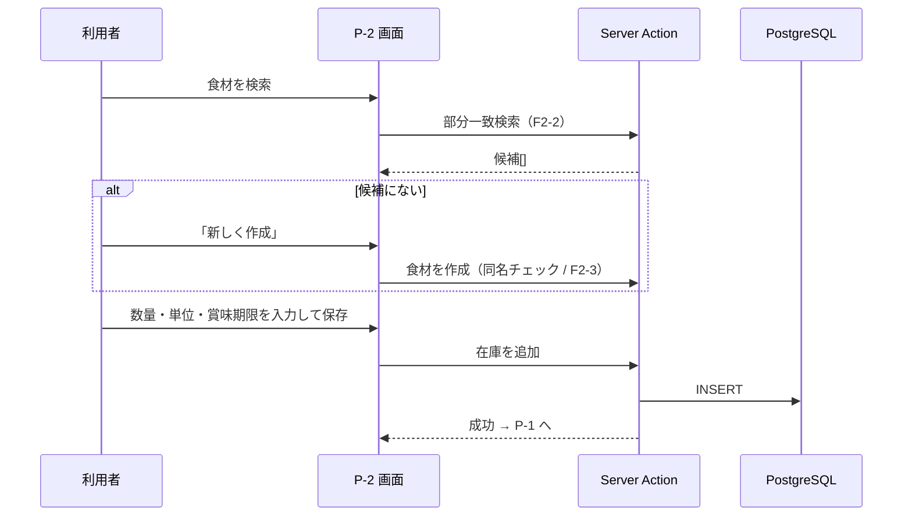
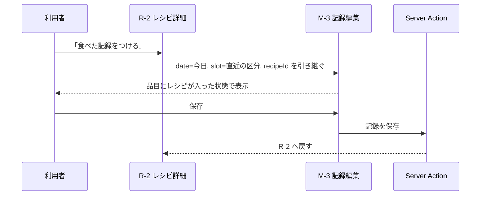

# システム設計書

CookingManager のシステム構造、データフロー、API、提案アルゴリズム、エラー処理、認証・認可を定義する。

関連: [要件定義書](../spec/cooking-manager-requirements.md) ／ [サイトマップ](sitemap.md) ／ [画面設計書](screen-design.md)

**この文書の範囲外**: テーブル定義・インデックス・マイグレーションの詳細は DB設計（Issue #6）、ディレクトリ構成の詳細は ファイル設計（Issue #7）で確定する。ここでは両者の方針のみ示す。

---

## 1. システム概要

個人用の料理管理 Web アプリケーション。単一ユーザーが自分のレシピ・在庫・食事記録を管理し、在庫から作れるレシピの提案を受ける。

| 項目 | 内容 |
|---|---|
| 利用者 | オーナー1人（将来の世帯共有に備え `owner_id` で表現 / NFR-14） |
| 主要デバイス | スマートフォン（375px幅 / NFR-8） |
| データ規模の想定 | レシピ200件、在庫100件（NFR-2） |
| 運用コスト | 無料枠または低コスト（NFR-15） |

---

## 2. アーキテクチャ

### 2.1 パターン

**Next.js App Router による単一デプロイのフルスタック構成**（サーバーコンポーネント中心）。

| 検討した案 | 判断 |
|---|---|
| フロント／API を分離した2サービス構成 | **不採用**。個人用の規模で運用対象が増える。NFR-15 に反する |
| BaaS 直叩き（クライアントから Supabase を直接呼ぶ） | **不採用**。提案の算出をクライアントで行うことになり NFR-3 に反する |
| **Next.js 単一デプロイ（採用）** | 提案の算出をサーバー側に置ける（NFR-3）。Vercel の無料枠で足りる（NFR-15） |

### 2.2 コンポーネント構成

| 層 | 技術 | 役割 |
|---|---|---|
| クライアント | React Server Components 中心、必要箇所のみ Client Components | 画面描画。フォームと数量増減のみ双方向 |
| UI | Tailwind CSS / shadcn/ui | [画面設計書](screen-design.md)のトークンを Tailwind の設定に移植する |
| サーバー処理 | Server Actions（変更系）／ Route Handlers（最小限） | 入力検証、認可、ドメイン層の呼び出し |
| ドメイン | 純粋な TypeScript モジュール | **提案アルゴリズム**（NFR-13）、単位変換 |
| データアクセス | Drizzle ORM | クエリ。型はスキーマから生成 |
| DB | Supabase（PostgreSQL） | 永続化。RLS で行レベルの遮断（NFR-4） |
| 認証 | Supabase Auth | メール＋パスワード（F1-1）、セッション管理 |
| ホスティング | Vercel | 本番・プレビュー環境 |

### 2.3 レイヤ間の依存方向



**ドメイン層は DB もフレームワークも参照しない。** 提案アルゴリズムは在庫とレシピの配列を受け取り、提案の配列を返す純関数として実装する。これにより DB なしで単体テストできる（NFR-13）。

---

## 3. データフロー

### 3.1 全体構成



### 3.2 認証フロー（F1-1, F1-2）



### 3.3 レシピ提案の算出（F6-1〜F6-7, NFR-2, NFR-3）



### 3.4 在庫の追加（F5-1, NFR-9）



### 3.5 レシピ詳細から食事記録へ（F4-1, NFR-9）



---

## 4. インターフェース定義

TypeScript で定義する。実際の型は Drizzle のスキーマから生成し、ドメイン層は下記の形を入出力に使う。

### 4.1 エンティティ

```typescript
type UUID = string;
/** 保存は UTC、表示は Asia/Tokyo（NFR-11） */
type ISODateTime = string;
/** YYYY-MM-DD */
type DateOnly = string;

/** 単位。質量・容量は換算し、可算単位は換算しない（F6-6） */
type Unit = 'g' | 'kg' | 'ml' | 'L' | '個' | '袋' | 'パック' | '本' | '束' | '枚' | '缶' | '箱';

type MealSlot = 'breakfast' | 'lunch' | 'dinner' | 'snack';

/** 食材マスタ（F2-1） */
interface Ingredient {
  id: UUID;
  ownerId: UUID;
  name: string;
  defaultUnit: Unit;
  /** 常備食材。true なら不足判定から除外する（F6-4） */
  isStaple: boolean;
}

/** レシピ（F3-1, F3-2） */
interface Recipe {
  id: UUID;
  ownerId: UUID;
  name: string;
  /** 1件以上必須（F3-2） */
  ingredients: RecipeIngredient[];
  steps: string[];
  note: string | null;
}

interface RecipeIngredient {
  ingredientId: UUID;
  quantity: number;
  unit: Unit;
}

/** 在庫（F5-1） */
interface InventoryItem {
  id: UUID;
  ownerId: UUID;
  ingredientId: UUID;
  quantity: number;
  unit: Unit;
  /** 任意。null は期限なしで、期限切れ判定の対象外 */
  expiresAt: DateOnly | null;
}

/** 食事記録（F4-1〜F4-3） */
interface Meal {
  id: UUID;
  ownerId: UUID;
  date: DateOnly;
  slot: MealSlot;
  /** 1回の食事に複数の品目（F4-3） */
  items: MealItem[];
  note: string | null;
}

/** レシピ選択と自由入力のいずれか（F4-2） */
type MealItem =
  | { kind: 'recipe'; recipeId: UUID }
  | { kind: 'free'; text: string };
```

### 4.2 提案の入出力

```typescript
/** 材料ごとの充足状態 */
type MatchState =
  /** 在庫で賄える */
  | 'satisfied'
  /** 常備食材のため判定対象外（F6-4） */
  | 'staple'
  /** 在庫はあるが単位を換算できず数量比較ができない（F6-6） */
  | 'unknown'
  /** 不足 */
  | 'missing';

interface IngredientMatch {
  ingredientId: UUID;
  ingredientName: string;
  required: { quantity: number; unit: Unit };
  state: MatchState;
  /** state === 'missing' のときのみ。表示用に required.unit で返す（F6-3） */
  shortage: { quantity: number; unit: Unit } | null;
}

interface RecipeSuggestion {
  recipeId: UUID;
  recipeName: string;
  matches: IngredientMatch[];
  /** state === 'missing' の件数。並び順の第1キー（F6-2） */
  missingCount: number;
  /** state === 'unknown' の件数。並び順の第2キー */
  unknownCount: number;
  /** 判定対象の材料数（常備食材を除く）。画面の「食材 3/4」の分母 */
  requiredCount: number;
  /** 充足した材料数。上記の分子 */
  satisfiedCount: number;
}
```

### 4.3 共通のレスポンス型

```typescript
type ActionResult<T> =
  | { ok: true; data: T }
  | { ok: false; error: AppError };

interface AppError {
  code: ErrorCode;
  message: string;
  /** フォームのフィールド単位のエラー。キーはフィールド名 */
  fields?: Record<string, string>;
}

type ErrorCode =
  | 'VALIDATION_ERROR'
  | 'UNAUTHENTICATED'
  | 'FORBIDDEN'
  | 'NOT_FOUND'
  | 'CONFLICT'
  | 'INTERNAL_ERROR';
```

---

## 5. 提案アルゴリズム

要件 F6-1〜F6-6 と F5-5 の中核。ドメイン層の純関数として実装し、単体テストを用意する（NFR-13）。

### 5.1 単位変換ルール（F6-6）

質量と容量のみ換算する。可算単位は換算しない。

| 次元 | 単位 | 基準単位への換算 |
|---|---|---|
| 質量 | `g` | ×1 |
| 質量 | `kg` | ×1000 → `g` |
| 容量 | `ml` | ×1 |
| 容量 | `L` | ×1000 → `ml` |
| 可算 | `個` `袋` `パック` `本` `束` `枚` `缶` `箱` | 換算しない。**同一単位同士のみ比較する** |

判定規則:

1. 両者が同じ次元（質量同士・容量同士）→ 基準単位に揃えて比較できる
2. 両者が同じ可算単位（`個` と `個`）→ そのまま比較できる
3. それ以外（`個` と `g`、`袋` と `本` など）→ **比較しない**

3に該当し、かつ在庫が存在する場合は `unknown`（画面表示は `在庫あり（数量不明）`）とする。在庫が存在しない場合は `missing` とする。

**計算は基準単位の整数で行う。** `kg` `L` は1000倍して `g` `ml` に直してから加算・比較し、浮動小数点の誤差を避ける。表示に戻すときのみ元の単位へ割り戻す。

### 5.2 手順

```
入力: レシピ[], 在庫[], 食材マスタ[], 今日の日付
出力: 提案[]（不足の少ない順）

手順1  有効な在庫を絞る
       - 数量 > 0
       - 賞味期限が null、または 賞味期限 >= 今日          … F5-5

手順2  食材ごとに在庫を集計する                            … F6-5
       同一食材の在庫を「次元」ごとに合計する
       例: 鶏もも肉 300g + 0.2kg → 質量 500g
           卵 2個 + 1パック       → 可算[個] 2 / 可算[パック] 1

手順3  レシピごと・材料ごとに判定する                       … F6-1
       if 食材.常備食材 then state = 'staple'              … F6-4
       else
         在庫 = 手順2の集計[材料.食材]
         if 在庫が空 then state = 'missing'（不足＝必要量全量）
         else
           比較可能な在庫量 = 材料の単位と同じ次元の合計    … F6-6
           if 比較可能な在庫量 >= 必要量 then state = 'satisfied'
           else if 比較できない在庫が存在する then state = 'unknown'
           else
             state   = 'missing'
             不足数量 = 必要量 - 比較可能な在庫量           … F6-3

手順4  レシピごとに集計する
       missingCount   = state が 'missing' の材料数
       unknownCount   = state が 'unknown' の材料数
       requiredCount  = 'staple' を除く材料数
       satisfiedCount = state が 'satisfied' の材料数

手順5  並べ替える                                          … F6-2
       第1キー missingCount        昇順
       第2キー unknownCount        昇順
       第3キー 使用する在庫の最短賞味期限  昇順（期限が近い在庫を使う案を優先）
       第4キー レシピ名             昇順（安定化のため）
```

第3キーと第4キーは要件にない**設計上の決定**。F6-2 は「不足の少ない順」しか定めておらず、不足数が同じレシピ同士の順序が不定になるため、期限の近い在庫を消費する案を上位に置く。

### 5.3 疑似コード

```typescript
function suggest(
  recipes: Recipe[],
  inventory: InventoryItem[],
  ingredients: Map<UUID, Ingredient>,
  today: DateOnly,
): RecipeSuggestion[] {
  // 手順1: 有効な在庫（F5-5）
  const active = inventory.filter(
    (i) => i.quantity > 0 && (i.expiresAt === null || i.expiresAt >= today),
  );

  // 手順2: 食材ごと・次元ごとに合計（F6-5）
  //   キー: `${ingredientId}:${dimensionOf(unit)}`、値: 基準単位の合計
  const totals = new Map<string, number>();
  const earliestExpiry = new Map<UUID, DateOnly>();
  for (const lot of active) {
    const key = `${lot.ingredientId}:${dimensionOf(lot.unit)}`;
    totals.set(key, (totals.get(key) ?? 0) + toBaseUnit(lot.quantity, lot.unit));
    if (lot.expiresAt) {
      const cur = earliestExpiry.get(lot.ingredientId);
      if (!cur || lot.expiresAt < cur) earliestExpiry.set(lot.ingredientId, lot.expiresAt);
    }
  }

  const suggestions = recipes.map((recipe) => {
    const matches = recipe.ingredients.map((req): IngredientMatch => {
      const ingredient = ingredients.get(req.ingredientId)!;
      const base = { ingredientId: req.ingredientId, ingredientName: ingredient.name,
                     required: { quantity: req.quantity, unit: req.unit } };

      // 常備食材は判定しない（F6-4）
      if (ingredient.isStaple) return { ...base, state: 'staple', shortage: null };

      const dim = dimensionOf(req.unit);
      const comparable = totals.get(`${req.ingredientId}:${dim}`) ?? 0;
      const hasOtherDimension = [...totals.keys()].some(
        (k) => k.startsWith(`${req.ingredientId}:`) && !k.endsWith(`:${dim}`),
      );

      if (comparable === 0 && !hasOtherDimension) {
        return { ...base, state: 'missing',
                 shortage: { quantity: req.quantity, unit: req.unit } };
      }

      const requiredBase = toBaseUnit(req.quantity, req.unit);
      if (comparable >= requiredBase) return { ...base, state: 'satisfied', shortage: null };

      // 換算できない在庫が残っている場合は数量を断定しない（F6-6）
      if (hasOtherDimension) return { ...base, state: 'unknown', shortage: null };

      return {
        ...base,
        state: 'missing',
        shortage: { quantity: fromBaseUnit(requiredBase - comparable, req.unit), unit: req.unit },
      };
    });

    const counted = matches.filter((m) => m.state !== 'staple');
    return {
      recipeId: recipe.id,
      recipeName: recipe.name,
      matches,
      missingCount: matches.filter((m) => m.state === 'missing').length,
      unknownCount: matches.filter((m) => m.state === 'unknown').length,
      requiredCount: counted.length,
      satisfiedCount: matches.filter((m) => m.state === 'satisfied').length,
    };
  });

  // 手順5: 並べ替え（F6-2）
  return suggestions.sort((a, b) =>
    a.missingCount - b.missingCount ||
    a.unknownCount - b.unknownCount ||
    compareEarliestExpiry(a, b, earliestExpiry) ||
    a.recipeName.localeCompare(b.recipeName, 'ja'),
  );
}

/** 'mass' | 'volume' | `count:${Unit}`。可算単位は単位ごとに別の次元として扱う */
function dimensionOf(unit: Unit): string {
  if (unit === 'g' || unit === 'kg') return 'mass';
  if (unit === 'ml' || unit === 'L') return 'volume';
  return `count:${unit}`;
}

function toBaseUnit(quantity: number, unit: Unit): number {
  if (unit === 'kg' || unit === 'L') return Math.round(quantity * 1000);
  return quantity;
}

function fromBaseUnit(base: number, unit: Unit): number {
  if (unit === 'kg' || unit === 'L') return base / 1000;
  return base;
}
```

### 5.4 単体テストで押さえる条件（NFR-13）

| # | 条件 | 期待 |
|---|---|---|
| 1 | 在庫が必要量ちょうど | `satisfied` |
| 2 | `kg` の在庫に対し `g` の材料 | 換算して判定 |
| 3 | 同一食材が複数ロット | 合計で判定（F6-5） |
| 4 | `個` の在庫に対し `g` の材料 | `unknown`（F6-6） |
| 5 | 在庫なし | `missing`、不足＝必要量全量 |
| 6 | 常備食材 | `staple`、分母に数えない（F6-4） |
| 7 | 期限切れの在庫のみ | `missing`（F5-5） |
| 8 | 期限が null の在庫 | 有効として扱う |
| 9 | 不足数が同じレシピ2件 | 期限の近い在庫を使う側が上位 |
| 10 | レシピ0件／在庫0件 | 空配列を返す（画面側で F6-7 の案内） |

---

## 6. 性能方針（NFR-2, NFR-3）

| # | 方針 | 内容 |
|---|---|---|
| 1 | サーバー側で算出する | Server Component 内で実行し、全レシピをクライアントへ送らない（NFR-3）。画面へは提案の配列のみ返す |
| 2 | クエリは2本に抑える | 「有効な在庫（食材を結合）」と「全レシピ＋材料」。レシピごとに問い合わせない（N+1の禁止） |
| 3 | 計算はメモリ上で行う | レシピ200件 × 平均材料6件 = 約1200回の判定。Map 参照のみで O(R×I)。1秒（NFR-2）に対して十分な余裕がある |
| 4 | インデックス | `recipe_ingredients(recipe_id)`、`inventory(owner_id, expires_at)`、`ingredients(owner_id, name)`。詳細は DB設計（#6） |
| 5 | キャッシュ | 初期は入れない。必要になった時点で `unstable_cache` ＋ 在庫・レシピ更新時の `revalidateTag('suggestions')` を検討する |
| 6 | 計測 | レシピ200件・在庫100件のシードデータで算出時間を測る試験を CI に置き、1秒を超えたら失敗させる |

方針5を先送りにするのは、キャッシュを入れると在庫更新直後に古い提案が出る不整合を招き、個人用の規模では計算し直すほうが単純なため。

---

## 7. API 仕様

### 7.1 方針

**変更系は Server Actions、参照系はサーバーコンポーネントからの直接呼び出しを基本とする。** REST のエンドポイントは、クライアント側から逐次呼ぶ必要がある検索のみ Route Handler として置く。

理由は、画面とサーバー処理が同一デプロイにあり、型を共有できるため。HTTP 層を挟むと型定義とエラー処理が二重になる。

### 7.2 Server Actions 一覧

| 操作 | シグネチャ | 対応要件 |
|---|---|---|
| ログイン | `signIn(email, password): ActionResult<void>` | F1-1 |
| 新規登録 | `signUp(email, password): ActionResult<void>` | F1-1 |
| ログアウト | `signOut(): ActionResult<void>` | F1-3 |
| 食材の作成 | `createIngredient(input): ActionResult<Ingredient>` | F2-1, F2-3 |
| 食材の更新 | `updateIngredient(id, input): ActionResult<Ingredient>` | F2-1 |
| 食材の削除 | `deleteIngredient(id): ActionResult<void>` | F2-1 |
| レシピの作成 | `createRecipe(input): ActionResult<Recipe>` | F3-1, F3-2 |
| レシピの更新 | `updateRecipe(id, input): ActionResult<Recipe>` | F3-1 |
| レシピの削除 | `deleteRecipe(id): ActionResult<void>` | F3-1 |
| 在庫の追加 | `addInventory(input): ActionResult<InventoryItem>` | F5-1 |
| 在庫の更新 | `updateInventory(id, input): ActionResult<InventoryItem>` | F5-1 |
| 在庫の数量変更 | `changeInventoryQuantity(id, delta): ActionResult<InventoryItem>` | F5-3 |
| 在庫の削除 | `deleteInventory(id): ActionResult<void>` | F5-1 |
| 食事記録の保存 | `saveMeal(date, slot, input): ActionResult<Meal>` | F4-1〜F4-3 |
| 食事記録の削除 | `deleteMeal(id): ActionResult<void>` | F4-1 |

### 7.3 サーバー側の参照関数

画面（Server Component）から直接呼ぶ。HTTP は経由しない。

| 関数 | 戻り値 | 対応要件 | 使用画面 |
|---|---|---|---|
| `getSuggestions()` | `RecipeSuggestion[]` | F6-1〜F6-6 | S-1 |
| `listRecipes(query?)` | `Recipe[]` | F3-3 | R-1 |
| `getRecipeWithStock(id)` | `Recipe & { matches: IngredientMatch[] }` | F3-4 | R-2 |
| `listInventory()` | `InventoryItem[]`（期限の近い順） | F5-2, F5-4, F5-5 | P-1 |
| `getMealCalendar(year, month)` | `{ date: DateOnly; slots: MealSlot[] }[]` | F4-4 | M-1 |
| `getMealsByDate(date)` | `Meal[]` | F4-4 | M-2 |
| `listIngredients(query?)` | `Ingredient[]` | F2-1 | C-2 |

### 7.4 Route Handlers

| メソッド | パス | 用途 | 対応要件 |
|---|---|---|---|
| `GET` | `/api/ingredients/search?q=` | 食材の部分一致検索。入力中に逐次呼ぶ | F2-2, F2-3 |
| `GET` | `/api/recipes/search?q=` | レシピ名の検索。M-3 の品目選択で使う | F4-2 |

リクエスト例:

```
GET /api/ingredients/search?q=ほうれん
```

レスポンス例:

```json
{
  "ok": true,
  "data": [
    { "id": "…", "name": "ほうれん草", "defaultUnit": "袋", "isStaple": false },
    { "id": "…", "name": "サラダほうれん草", "defaultUnit": "袋", "isStaple": false }
  ]
}
```

同名の食材が既にある場合も候補として返し、画面側で重複作成を防ぐ（F2-3）。

---

## 8. エラーハンドリング

### 8.1 エラーコードと扱い

| コード | 発生条件 | HTTP相当 | 画面での扱い |
|---|---|---|---|
| `VALIDATION_ERROR` | 入力値が不正。材料0件（F3-2）など | 400 | フォームのフィールド下に表示。`fields` を使う |
| `UNAUTHENTICATED` | セッションがない・期限切れ | 401 | `/login` へリダイレクト |
| `FORBIDDEN` | 他オーナーの行への操作（F1-2） | 403 | 「操作できません」をトースト表示。詳細は出さない |
| `NOT_FOUND` | 対象が存在しない・削除済み | 404 | 一覧へ戻し「対象が見つかりません」を表示 |
| `CONFLICT` | 同名食材の重複作成（F2-3）など | 409 | 既存候補を提示して選び直させる |
| `INTERNAL_ERROR` | 想定外 | 500 | 「時間をおいて再試行してください」。詳細はログのみ |

### 8.2 方針

1. **ドメイン層は例外を投げない。** 判定結果を値で返し、Server Action が `ActionResult` に詰める
2. **入力検証は Zod でサーバー側に置く。** クライアント側の検証は体験のための重複実装であり、正は常にサーバー
3. **想定外の例外はすべて `INTERNAL_ERROR` に畳む。** スタックトレースや SQL を利用者へ出さない
4. **在庫の数量変更（F5-3）は相対値で送る。** 連打による競合を避けるため絶対値ではなく `delta` を渡し、DB 側で `quantity = quantity + delta` として加算する。結果が負になる場合は0で止める
5. **削除は確認後に実行する（NFR-10）。** 確認は画面側の責務で、サーバー側は冪等に扱う（削除済みなら `NOT_FOUND` ではなく成功として返す）

---

## 9. 認証・認可

### 9.1 認証（F1-1, F1-3）

Supabase Auth のメール＋パスワード。パスワードのハッシュ化は Supabase 側が行う（NFR-5）。通信は Vercel と Supabase の双方で HTTPS のみ（NFR-6）。

セッションは Cookie で保持し、`middleware.ts` で全ての要ログイン経路を検証する。未ログインのアクセスは `/login` へリダイレクトする。

### 9.2 認可（F1-2, NFR-4）

**アプリケーション層と DB 層の二重で遮断する。**

| 層 | 仕組み |
|---|---|
| アプリケーション層 | Server Action の冒頭でセッションから `ownerId` を取得し、クエリ条件に必ず含める。クライアントから渡された `ownerId` は信用しない |
| DB層 | 全テーブルに RLS を有効化し、`owner_id = auth.uid()` のポリシーを置く。アプリ側の条件漏れがあっても他人の行に到達しない |

`owner_id` は単一のオーナーIDで所有を表現する（NFR-14）。将来の世帯共有では、この列を世帯IDに読み替えるか、中間テーブルを足す形で拡張する。

### 9.3 秘匿情報

`SUPABASE_SERVICE_ROLE_KEY` などの秘匿値はリポジトリに置かず、Vercel の環境変数で管理する（NFR-7）。`.env.example` にキー名のみ記載する。サービスロールキーはサーバー側でのみ使用し、クライアントへ露出させない。

---

## 10. 完了条件の対応

Issue #4 の完了条件と、本書の該当箇所。

| 完了条件 | 該当箇所 |
|---|---|
| 提案アルゴリズムが疑似コードまたはフローで書かれている | [5.2 手順](#52-手順)、[5.3 疑似コード](#53-疑似コード) |
| 単位変換の変換表と、変換不能時の判定が明記されている | [5.1 単位変換ルール](#51-単位変換ルールf6-6) |
| API一覧が揃っている | [7章](#7-api-仕様)（Server Actions 15件、参照関数7件、Route Handler 2件） |
| NFR-2 を満たす方針が書かれている | [6章](#6-性能方針nfr-2-nfr-3) |

---

## 11. 次工程への引き継ぎ

| 項目 | 引き継ぎ先 |
|---|---|
| テーブル定義、インデックス、RLSポリシーの具体、マイグレーション | DB設計（#6） |
| 単位の選択肢の確定と、変換ルールをどこに持つか（定数かマスタか） | DB設計（#6） |
| 在庫・レシピから参照される食材を削除したときの挙動（制約か論理削除か） | DB設計（#6） |
| ディレクトリ構成、モジュール境界、命名規則 | ファイル設計（#7） |
| 画面設計書の未確定事項5件 | [画面設計書 8章](screen-design.md#8-未確定事項) |
